# GHARuns_Collector

A large-scale data extraction pipeline designed to collect massive datasets of GitHub Actions workflow runs, jobs, steps. This tool was developed for the **ICSME 2026 Data Track** to support empirical research on CI/CD reliability and maintainability.

```mermaid
flowchart LR
    %% Define the Color Palette with larger fonts and padding
    classDef core fill:#f3f4f6,stroke:#9e9e9e,stroke-width:3px,font-size:16px,padding:10px;
    classDef phaseA fill:#e3f2fd,stroke:#0288d1,stroke-width:3px,font-size:16px,padding:10px;
    classDef phaseB fill:#e8f5e9,stroke:#388e3c,stroke-width:3px,font-size:16px,padding:10px;
    classDef phaseC fill:#fff8e1,stroke:#f57c00,stroke-width:3px,font-size:16px,padding:10px;
    classDef decision fill:#fff9c4,stroke:#fbc02d,stroke-width:3px,font-size:16px,padding:10px;
    classDef endpoint fill:#374151,color:#fff,stroke:#374151,stroke-width:3px,font-size:18px,font-weight:bold,padding:15px;

    %% Nodes and Connections
    A(["Start"]) --> B["Load Repository List"]
    B --> C["Resolve Time Window\nfrom state file"]
    C --> D{"Within grace\nperiod?"}
    D -- Yes --> Z(["End"])
    D -- No --> E{"Phase A\nalready complete?"}
    
    E -- No --> F["Phase A — REST Discovery"]
    F --> G["Query REST API\nfor completed runs"]
    G --> H["Filter & save runs\nto runs.jsonl"]
    H --> I["Enqueue check suite IDs\ninto GraphQL buffer"]
    I --> J{"GraphQL buffer\nfull?"}
    
    J -- Yes --> K["Phase B — GraphQL Enrichment"]
    J -- No, next repo --> F
    
    E -- Yes --> K
    K --> L["Batch-query jobs & steps\nvia GraphQL API"]
    L --> M{"Run exceeds\nGraphQL page limits?"}
    M -- No --> N["Write jobs & steps\nto details.jsonl"]
    M -- Yes --> O["Add to massive\nruns buffer"]
    
    N --> P{"More runs\nin GraphQL buffer?"}
    O --> P
    P -- Yes --> L
    P -- No --> Q{"Any massive runs\nin buffer?"}
    
    Q -- No --> U["Save report &\ncheckpoint state"]
    Q -- Yes --> R["Phase C — REST Cleanup Crew"]
    R --> S["Fetch full jobs & steps\nvia REST API"]
    S --> T["Write to details.jsonl"]
    T --> U
    
    U --> V{"More windows\nto process?"}
    V -- Yes --> C
    V -- No --> Z

    %% Apply Classes Safely
    class A,Z endpoint;
    class B,C,U core;
    class D,E,J,M,P,Q,V decision;
    class F,G,H,I phaseA;
    class K,L,N,O phaseB;
    class R,S,T phaseC;

```

